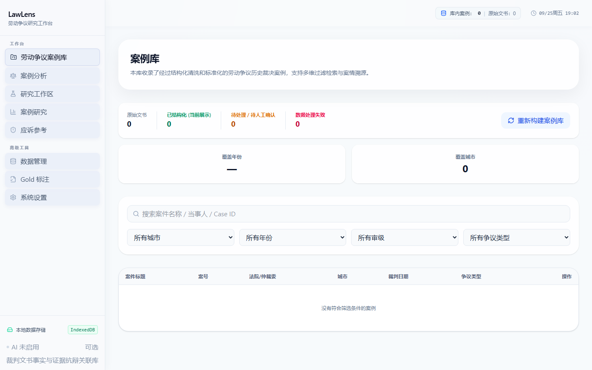
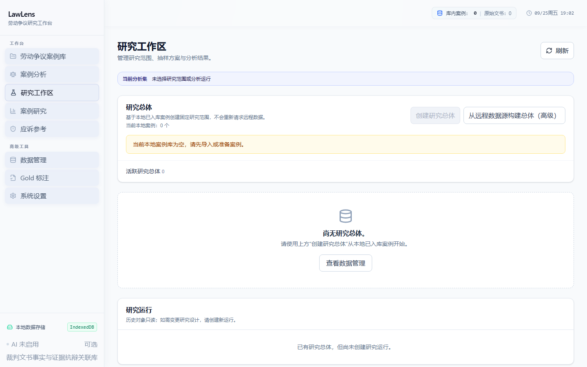
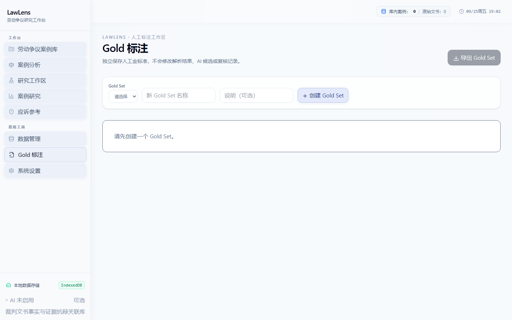

# LawLens

劳动争议裁判文书可信智能解析与实证研究平台
*Trustworthy AI-assisted Legal Analytics for Labor Dispute Judgments*

LawLens 面向劳动争议实证研究，将非结构化裁判文书转换为可核验、可追溯、可统计的结构化研究数据。系统使用规则和语义解析生成候选，再由程序约束、人工复核和准入流程决定哪些记录可以进入确定性统计。

> **AI generates candidates. Programs validate constraints. Humans resolve uncertainty.**

## Demo

[打开 GitHub Pages Demo](https://lyzerh.github.io/Analysis-of-Labor-Disputes/)

无需 API Key 即可查看本地案例管理、研究工作区和确定性分析流程。启用 AI 语义解析时，用户需要在系统设置中自行配置 xAI API Key；仓库不内置密钥。

## Why LawLens

劳动争议裁判文书通常具有非结构化、主体视角复杂、诉求与裁判结果跨段落、原诉 / 反诉 / 上诉语境交织等特点。实证研究还需要固定研究总体、保留来源和身份信息，并能解释哪些记录被排除以及为什么排除。

LawLens 的目标不是自动作出法律判断，而是把文书整理成研究者可以检查、复核和回溯的研究数据。

## Core Architecture

```text
Judgment
   ↓
Rules / Parser
   ↓
LLM Semantic Resolver
   ↓
Structured Candidate
   ↓
Claim Identity
   ↓
Schema / Validator / Audit
   ↓
Human Review / Analytics Gate
   ↓
Deterministic Analytics
```

LLM 输出是候选，不是研究事实。确定性程序负责字段、身份、证据和关系约束；无法安全确认的记录保留为未决或进入人工复核，不静默进入统计。

## Trustworthy AI Workflow

- **Deterministic program**：解析稳定字段、校验 schema、检查身份和来源证据，并执行 Analytics Gate。
- **LLM**：只对指定的未决语义关系提出候选，不创建新的案件、诉求、金额或案件级结论。
- **Human review**：处理低置信、冲突、上下文不足和上诉依赖等情况，并决定是否可以进入研究总体。

核心原则：**AI 负责提出候选；程序负责验证约束；人工负责处理不确定性。**

## Evaluation

当前材料记录的 Gold Set 包含 10 个案例；正式 Benchmark 只纳入其中身份已核验的实体性诉求。

- **8 / 8 invocation success**：8 条身份已核验诉求均完成调用。
- **5 / 8 explicit candidate coverage = 62.5%**：5 条形成明确候选，3 条保持未决。
- **5 / 5 explicit candidates matched human Gold = 100%**：明确候选子集全部与人工 Gold 一致。
- **3 / 8 unresolved / human review = 37.5%**：未决记录保留人工复核路径。
- **explicit candidate incorrect = 0 / 5**：明确候选中没有错误匹配。

5/5 只表示形成明确候选的 5 条诉求均与人工 Gold 一致，不代表系统总体准确率为 100%。这是小规模方法验证，不能外推为全部劳动争议裁判文书上的总体模型准确率。

## Rules-only Baseline

在人工标注的 26 条已抽取实体性诉求中：

- correct：12
- wrong_type：4
- spurious：10
- 12 / 26 = 46.2%

该比例不是完整 extraction accuracy，因为当前材料没有统计 missed claims / recall。Rules-only 基线与 Benchmark 的分母、对象和任务不同，不能直接比较为“46.2% 到 100%”。

## Screenshots

以下截图来自当前本地 LawLens 界面，不包含 API Key、学校、指导教师或个人信息。

### Human Review / Case Library



### Research Analytics Workspace



### Gold Benchmark Workspace



## Research Workflow

```text
Document Acquisition
   → Parsing
   → Semantic Candidate
   → Validation
   → Human Review
   → Research Population Snapshot
   → AnalysisRun
   → Deterministic Analytics
```

## Data Sources

| Source | Purpose | Status | Notes |
| --- | --- | --- | --- |
| LaborInfoCN / 工劳网 | 公共劳动争议文书的候选检索、元数据和文书详情 | Current | 上游可用性、覆盖和元数据质量取决于来源；不宣称其为官方政府数据库 |
| Synthetic Demo Fixture | UI、解析和流程演示 | Synthetic | 合成内容，仅用于界面与流程演示，不作为研究分析数据；不使用仿真政务 URL |
| Shenzhen HRSS adapter | 旧的政务网页采集兼容链路 | Legacy / separate adapter | 保留用于兼容和历史工作流说明，不等同于本研究叙事中的当前 LaborInfoCN 来源 |
| Local document import | 用户自行提供的 HTML、MHT、TXT 或 PDF 文书 | Local input | 处理和存储在浏览器本地；来源真实性由使用者负责核验 |

## AI Provider

### Current formal browser path

- Provider: **xAI**
- Model: **grok-4.20-0309-reasoning**
- Endpoint: `https://api.x.ai/v1/chat/completions`
- Runtime path: `LlmRuntimeService → BrowserXaiSemanticClient`
- Key model: BYOK（Bring Your Own Key）
- Key storage: `sessionStorage`

### Legacy / historical paths

Gemini 的 server-side resolver、DeepSeek adapter 和其他实验 provider 仅作为 legacy / historical compatibility 或实验记录保留；它们不是当前 GitHub Pages 浏览器端正式语义服务。`server.ts` 与 `scripts/semantic-smoke.ts` 中的 Gemini 路径需要单独的 legacy `GEMINI_API_KEY`，不属于打开 Demo 的必要条件。

## Privacy & Data Boundary

除 AI 语义解析步骤外，案例管理、人工复核、研究总体冻结和确定性统计均在本地完成。启用 AI 语义解析时，待解析文本将发送至用户自行配置的 xAI API 服务。

LawLens 不声称完全离线、绝对安全或零隐私风险。API Key 只保存在当前浏览器会话的 `sessionStorage` 中；用户应自行评估发送文本和使用第三方服务的适当性。

## Quick Start

CI 当前使用 Node.js 22；本地建议使用兼容的 Node.js 22 环境和 npm。

```bash
npm ci
npm run dev
```

打开 `http://localhost:3000/`。不配置 API Key 也可以查看本地工作流；需要语义解析时，在系统设置中启用 xAI BYOK。

常用验证命令：

```bash
npm run lint
npm test
npm run build
npm run build:pages
```

## Verification

当前公开基线：`47d2bd653a3ad949b0bb6622ed126ffc548a66e8`
提交：`feat: complete trustworthy legal analytics research workflow`

当前基线验证记录：

- `npm run lint`：PASS
- `npm test`：61 files / 849 tests PASS
- `npm run build`：PASS
- `npm run build:pages`：PASS；Pages base path 与静态资源检查通过

这些是工程和方法链验证，不是总体法律结果准确率声明。

## Technology

- React
- TypeScript / JavaScript
- Vite
- IndexedDB / Dexie
- PWA manifest and local-first browser workflow
- LaborInfoCN public data API
- xAI API（BYOK semantic resolution）
- Vitest
- GitHub Actions / GitHub Pages

## Project Scope

LawLens 是一个 **Research / Legal Analytics** 项目，关注劳动争议裁判文书的结构化、复核、研究总体冻结和确定性统计。

它不是：

- 法律意见或个案法律咨询
- 案件结果预测系统
- 自动司法或仲裁决定系统
- 无人工复核的全自动法律 AI

## Limitations

- Gold Set 和正式 Benchmark 规模较小，当前结果只支持方法边界验证。
- 未决和人工复核仍然是正式工作流的一部分。
- 启用语义解析时需要用户自行配置外部 xAI 服务。
- 当前材料不支持总体准确率、召回率或跨来源泛化结论。

更完整的已知限制、未实现分析能力和历史兼容路径记录在 [`docs/limitations.md`](docs/limitations.md)。

## Repository Structure

```text
src/       application and research workflow
tests/     deterministic regression and contract tests
scripts/   smoke checks and evaluation utilities
docs/      validation, experiments, and limitations
public/    PWA manifest and static assets
```

## License

License: Not specified yet.

## Disclaimer

本项目仅用于教育、研究与法律数据分析演示。系统展示的统计关联不构成法律意见，不预测案件结果，也不应被解释为因果关系。
